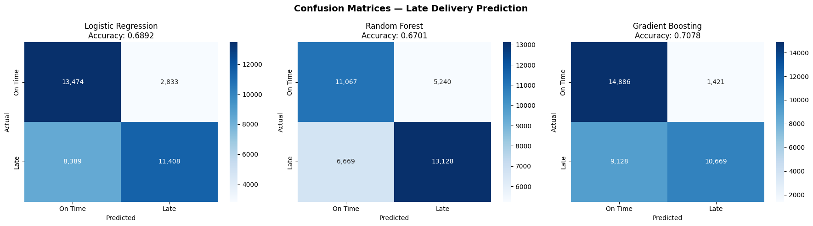
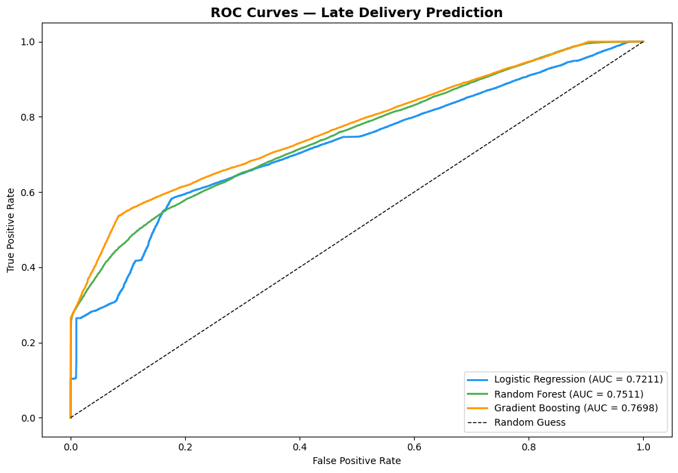
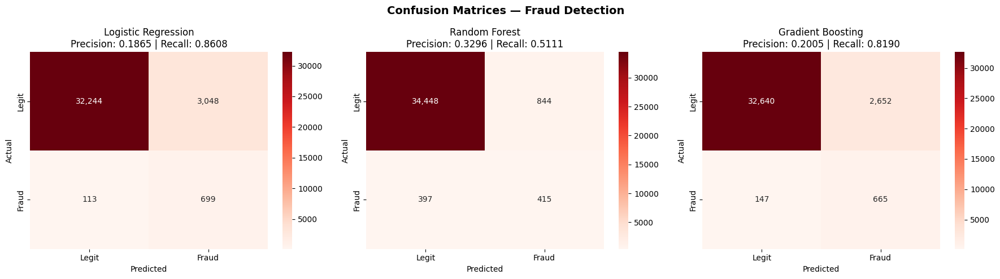
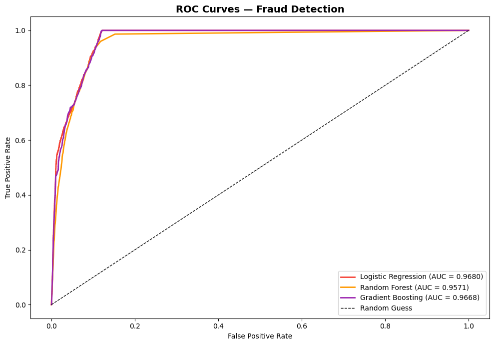
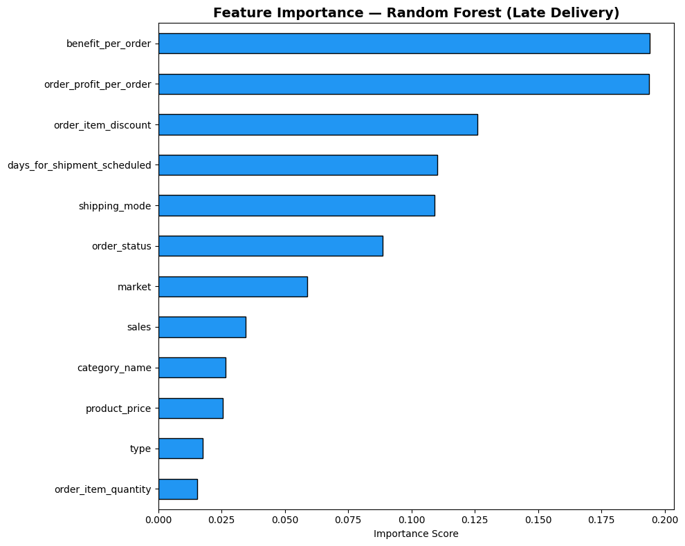

# DataCo Smart Supply Chain Analytics & Predictive Intelligence

---

<p align="center">


</p>

<p align="center">

<b>
An end-to-end Supply Chain Analytics project combining Data Cleaning, Exploratory Data Analysis, SQL-based KPI extraction, Interactive Dashboards, and Machine Learning models to uncover operational inefficiencies, optimize logistics performance, and predict supply chain risks.
</b>

</p>

---

# Table of Contents

- [Project Overview](#-project-overview)
- [Business Problem](#-business-problem)
- [Project Objectives](#-project-objectives)
- [Dataset Information](#-dataset-information)
- [Tech Stack](#-tech-stack)
- [Project Workflow](#-project-workflow)
- [Data Cleaning & Preparation](#-data-cleaning--preparation)
- [Exploratory Data Analysis](#-exploratory-data-analysis)
- [Dashboard Development & KPI Analysis](#-dashboard-development--kpi-analysis)
- [Machine Learning Models](#-machine-learning-models)
- [Model Performance & Results](#-model-performance--results)
- [Feature Importance Analysis](#-feature-importance-analysis)
- [Key Business Insights](#-key-business-insights)
- [Business Recommendations](#-business-recommendations)
- [Business Impact](#-business-impact)
- [Repository Structure](#-repository-structure)
- [Skills Demonstrated](#-skills-demonstrated)
- [Future Enhancements](#-future-enhancements)
- [Author](#-author)

---

# Project Overview

Modern supply chains generate massive volumes of operational and transactional data. Organizations must transform this data into insights that improve delivery performance, reduce operational costs, minimize fraud risk, and improve strategic decision-making.

This project analyzes **180,159 global supply chain records** from DataCo Global and develops an end-to-end analytics solution including:

✅ Data Cleaning & Transformation

✅ Exploratory Data Analysis

✅ SQL KPI Development

✅ Interactive Dashboarding

✅ Late Delivery Prediction

✅ Fraud Detection Modeling

The project follows a complete analytics lifecycle:

**Descriptive → Diagnostic → Predictive Analytics**

---

#  Business Problem

Global supply chain systems face several challenges:

- Delayed deliveries
- Revenue leakage
- Operational inefficiencies
- High logistics costs
- Fraudulent activities
- Poor visibility into performance metrics

Business stakeholders require answers to questions such as:

- Which regions generate the highest revenue?
- Which products generate maximum profit?
- Which shipping modes increase delay risk?
- What factors influence delivery delays?
- Can late deliveries be predicted?
- Can fraudulent transactions be identified?

---

#  Project Objectives

- Analyze overall supply chain performance
- Measure delivery efficiency
- Identify shipping bottlenecks
- Evaluate revenue and profitability
- Create KPI dashboards
- Predict late deliveries
- Detect fraudulent transactions
- Generate business recommendations

---

#  Dataset Information

**Dataset Source:** Kaggle — DataCo Smart Supply Chain Dataset

### Dataset Summary

| Metric | Value |
|----------|--------|
| Total Records | 180,159 |
| Total Features | 53 |
| Markets | Global |
| Product Categories | Multiple |
| Target Variables | Late Delivery Risk / Fraud Risk |

### Features Included

### Customer Information

- Country
- Region
- Market
- Customer Segment

### Product Information

- Product Category
- Product Price
- Quantity Ordered
- Discounts

### Logistics Information

- Shipping Mode
- Delivery Status
- Shipping Dates

### Financial Information

- Sales
- Profit
- Revenue

---

#  Tech Stack

| Technology | Purpose |
|------------|----------|
| Python | Core Development |
| Pandas | Data Processing |
| NumPy | Numerical Analysis |
| SQL | KPI Analysis |
| Plotly Dash | Interactive Dashboard |
| Matplotlib | Visualization |
| Seaborn | Visualization |
| Scikit-Learn | Machine Learning |
| XGBoost | Predictive Modeling |
| Git & GitHub | Version Control |

---

#  Project Workflow

```text
Raw Dataset (.CSV)
        │
        ▼
Data Cleaning Pipeline
        │
        ▼
Feature Engineering
        │
        ▼
Exploratory Data Analysis
        │
        ▼
SQL KPI Development
        │
        ▼
Dashboard Development
        │
        ▼
Machine Learning Models
        │
        ├── Late Delivery Prediction
        │
        └── Fraud Detection
        │
        ▼
Business Recommendations
```

---

#  Data Cleaning & Preparation

Data preprocessing was implemented using reusable Python functions.

### Tasks Performed

- Imported raw dataset
- Standardized column names
- Removed redundant features
- Converted date variables
- Assessed missing values
- Removed duplicate records
- Generated new analytical features
- Validated final dataset

### Derived Features

**Shipping Delay**

```python
shipping_delay_days =
days_for_shipping_real -
days_for_shipment_scheduled
```

**Profit Margin**

```python
profit_margin_pct =
(order_profit_per_order/sales)*100
```

**Time Variables**

- Order Month
- Order Year
- Order Day

---

#  Exploratory Data Analysis

EDA focused on understanding operational patterns.

Visualizations included:

- Monthly Order Trends
- Revenue by Market
- Delivery Status Distribution
- Shipping Delay Analysis
- Profit by Category
- Correlation Heatmaps
- Sales Trends
- Late Delivery Analysis

---

# Dashboard Development & KPI Analysis

Interactive dashboards were developed for business users.

### KPI Metrics

| KPI |
|------|
| Total Revenue |
| Profit Margin |
| Average Shipping Delay |
| On-Time Delivery Rate |
| Revenue by Category |
| Revenue by Region |
| Late Delivery Rate |
| Customer Segmentation |

Dashboard filters:

- Market
- Region
- Shipping Mode
- Product Category
- Time Period

---

#  Machine Learning Models

##  Late Delivery Prediction

Objective:

Predict whether an order will be delivered late.

Models evaluated:

- Logistic Regression
- Random Forest
- Gradient Boosting

Evaluation:

- Accuracy
- ROC Curve
- Confusion Matrix
- Feature Importance

---

##  Fraud Detection

Objective:

Identify suspicious transactions.

Models evaluated:

- Logistic Regression
- Random Forest
- Gradient Boosting

Evaluation:

- Precision
- Recall
- ROC-AUC
- Feature Importance

---

#  Model Performance & Results

## Late Delivery Prediction Results

| Model | Accuracy | AUC |
|---------|----------|------|
| Logistic Regression | 68.9% | 0.721 |
| Random Forest | 67.0% | 0.751 |
| Gradient Boosting | **70.8%** | **0.770** |

### Confusion Matrix



### ROC Curve



---

## Fraud Detection Results

| Model | Precision | Recall | AUC |
|---------|-----------|---------|------|
| Logistic Regression | 0.186 | **0.861** | 0.968 |
| Random Forest | **0.330** | 0.511 | 0.957 |
| Gradient Boosting | 0.201 | 0.819 | 0.967 |

### Confusion Matrix



### ROC Curve



---

#  Feature Importance Analysis

## Fraud Detection Feature Importance


Important drivers:

- Transaction Type
- Late Delivery Risk
- Shipping Delay
- Order Discount
- Profit Per Order

---

## Late Delivery Feature Importance



Important drivers:

- Benefit Per Order
- Profit Per Order
- Shipping Schedule
- Shipping Mode
- Order Status

---

#  Key Business Insights

##  Logistics Insights

- Shipping modes have varying delivery risk levels
- Delay patterns vary by region
- Delivery delays strongly influence customer experience

---

##  Revenue Insights

- High revenue products do not necessarily produce high profits
- Discounts significantly influence profitability
- Revenue concentration exists across specific categories

---

##  Fraud Detection Insights

- Negative profit transactions show suspicious patterns
- Fraud probability increases alongside delivery risk
- High margin orders require monitoring

---

##  Machine Learning Insights

- Gradient Boosting achieved best late-delivery prediction performance
- Fraud prediction showed strong recall capability
- Feature engineering significantly improved prediction accuracy

---

#  Business Recommendations

## Improve Logistics Performance

- Optimize shipment scheduling
- Improve warehouse allocation
- Monitor high-risk shipping routes

---

## Improve Profitability

- Optimize discount strategies
- Focus on high-margin products
- Improve product mix

---

## Strengthen Fraud Monitoring

- Deploy fraud scoring systems
- Implement anomaly detection
- Monitor suspicious transactions

---

#  Business Impact

Potential benefits:

✅ Reduced delivery delays

✅ Improved operational efficiency

✅ Lower logistics costs

✅ Increased profitability

✅ Better fraud prevention

✅ Improved decision-making

---

#  Repository Structure

```text
dataco-supply-chain-analysis/

├── data/
│   ├── raw/
│   └── processed/
│
├── notebooks/
│   ├── 01_eda_data_cleaning.ipynb
│   ├── 02_sql_kpi_dashboard.ipynb
│   └── 03_predictive_modeling.ipynb
│
├── src/
│   ├── data_cleaning-feature_engineering_visualization.py
│
│
│
├── sql/
│   └── supply_chain_queries.sql
│
├── reports/
│   └── figures/Images
│
├── requirements.txt
└── README.md
```

---

#  Skills Demonstrated

### Python

- Data Cleaning
- EDA
- Feature Engineering
- Visualization

### SQL

- KPI Analysis
- Aggregation
- Data Extraction

### Machine Learning

- Classification Models
- Model Evaluation
- Fraud Detection

### Business Analytics

- Supply Chain Analytics
- Risk Analysis
- KPI Reporting
- Data Storytelling

---

#  Future Enhancements

- Deploy models using Flask/FastAPI
- Create real-time dashboards
- Integrate cloud storage
- Add demand forecasting models
- Automate ETL pipelines

---

# 👨‍💻 Author

## Kartik Kachwahe

**Aspiring Data Scientist | Data Analyst | Machine Learning | SQL | Business Intelligence**

📧 Email: kartikkachwahe25@gmail.com

💼 LinkedIn: https://www.linkedin.com/in/kartikkachwahe021

💻 GitHub: https://github.com/KartikKachwahe

---

## ⭐ Support

If you found this project useful, consider giving this repository a ⭐

It helps improve visibility and motivates future development.

---

**Thank you for visiting this repository!**

**Thank you for visiting this repository 🚀**
